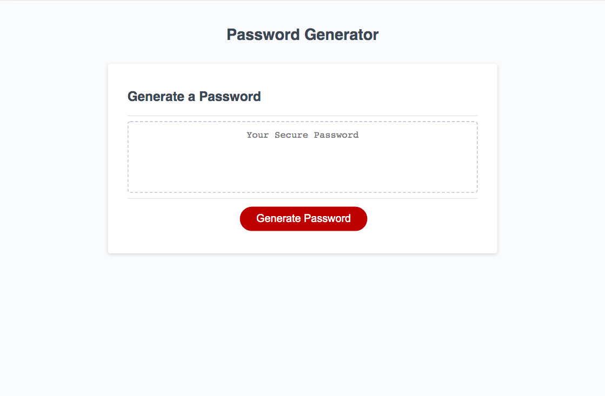
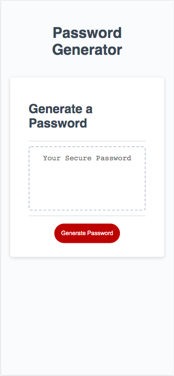

# Password Generator Website

## Table of Contents

* [Description](#description)
* [Snippets](#snippets)
* [Technologies](#technologies)
* [Preview](#preview)
* [Links](#links)

## Description

This project consisted on creating an application that anyone can use to generate a random password based on criteria they can select. It will include HTML and CSS powered by well functioning JavaScript code. 

## Snippets 

* **Questions asked to the client**
```            
var askNumbers = confirm("Do you want your password to include numbers?");

var askLowerCase = confirm("Do you want your password to include lower case letters?");

var askUpperCase = confirm("Do you want your password to include upper case letters?");

var askSpecial = confirm("Do you want your password to include special characters?");

```            

* **Declaration for criteria options**

```            
var numbers = ['0', '1', '2', '3', '4', '5', '6', '7', '8', '9'];
var upperCase = ['A', 'B', 'C', 'D', 'E', 'F', 'G', 'H', 'I', 'J', 'K', 'L', 'M', 'N', 'O', 'P', 'Q', 'R', 'S', 'T', 'U', 'V', 'W', 'X', 'Y', 'Z'];
var lowerCase = ['a', 'b', 'c', 'd', 'e', 'f', 'g', 'h', 'i', 'j', 'k', 'l', 'm', 'n', 'o', 'p', 'q', 'r', 's', 't', 'u', 'v', 'w', 'x', 'y', 'z'];
var specialCase = ['@', '%', '+', '/', "'", '!', '#', '$', '^', '?', ':', ',', ')', '(', '}', '{', ']', '[', '~', '-', '_', '.'];
```


* **For loop to generate the password correctly**
```            
  for (var i = 0; i < length; i++) {
      var options = choices[Math.floor(Math.random() * choices.length)];
      password.push(options);
  }
```   


## Technologies

* HTML
* CSS
* JavaScript

## Preview

This is the view of the password generator website in a computer view. 



This is the view of the password generator website in a cell phone view. 



## Links

* [URL of the deployed application](https://analuciarojas.github.io/challenge3/)

* [URL of the GitHub repository](https://github.com/analuciarojas/challenge3)